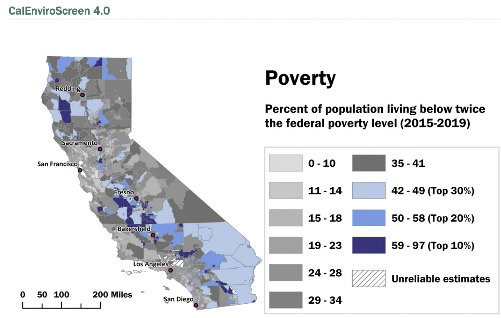

```{r setup, include=FALSE}
knitr::opts_chunk$set(echo = FALSE)
```

# Research Question 
In California from 2013 - 2021, does air quality (as measured by PM 2.5 concentrations) vary with poverty rates (as measured by the percent of the population living below two times the federal poverty level)? 

# Background / Motivation 
Why is this important? Is there existing evidence on this question? If so, why is it inconclusive? If not, why not?

# Methods

## Data Description / Collection 
Where did you access it? What are its spatial and temporal features? What are its limitations? What do you know about the sampling strategy and what biases that may introduce? If helpful, you can use a histogram, scatterplot, or summary statistics table to describe your data.

I downloaded 2013 - 2021 CalEnviroScreen data from the [California Office of Environmental Health Hazard Assessment (OEHHA)](https://oehha.ca.gov/) and the [California Open Data Portal](https://data.ca.gov/) : 

- [Versions 1.1 (Sept 2013)](https://oehha.ca.gov/calenviroscreen/report-general-info/calenviroscreen-11)
- [Versions 2.0 (Oct 2014)](https://oehha.ca.gov/calenviroscreen/report/calenviroscreen-version-20)
- [Versions 3.0 (June 2018)](https://data.ca.gov/dataset/calenviroscreen-3-0-results)
- [Versions 4.0 (Oct 2021)](https://oehha.ca.gov/calenviroscreen/report/calenviroscreen-40)

Each CalEnviroScreen dataset contains X columns of: 

- environmental pollution burden indicators
  - exposure indicators such as PM2.5
  - environmental effects indicators such as groundwater threats
- population characteristics: 
  - sensitive population indicators such as rates of asthma
  - socioeconomic factor indicators such as rates of poverty 
  


Each dataset also contains one row per census tract for a total of X rows, meaning each census tract in California is assigned a value per environmental indicator or population characteristic. 

In particular, I am interested in: 

1. **PM2.5:** the annual mean concentration of PM2.5, which CalEnviroScreen calculates based on a weighted average of measured monitor concentrations and satellite observations (ug/m3) over 3 years


2. **Poverty:** the percent of the population living below two times the federal poverty level, which CalEnviroScreen calculates using a 5-year estimate. For example, for the CES 1.1 report, they used a 5-year estimate from 2007 - 2011 data while in the CES 4.0 report, they used a 5-year estimate from 2015 - 2019 data. Multiple years of data are used to calculate more reliable results for geographic areas with small populations. 

CalEnviroScreen defined poverty as twice below the federal poverty line to account for California's high cost of living relative to other states and because the federal poverty threshold has not changed since the 1980s despite the cost of living increasing over time. 

The percent per census tract was calculated by individuals living below 200% the poverty level per census tract / total individuals living below 200% of the poverty level. 

Standard error and relative standard error were calculated to determine the reliability of the calculated poverty rate. Census tracts with unreliable estimates were assigned no value for poverty rate (NULL). 



CalEnviroScreen used poverty data collected annually by the US Census Bureau's American Community Survey (ACS)

Therefore, we can use this data to explore how PM2.5 and poverty rates

## Statistical Analysis 
What is your analysis plan? Why did you choose this analysis, given your data and question? What are the limitations?

# Results
Show us your results in figure(s) and/or table(s) that are carefully labeled and captioned. Describe in the text (and orally when presenting) what you found, and how these results either do or do not help you answer your question.

## Figures 

# Conclusions 

# Future Directions 
One short analysis cannot fully answer an interesting scientific question. If you had time to collect more data or conduct more analysis, what would help you answer this question better?