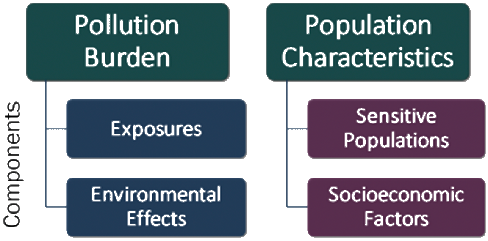
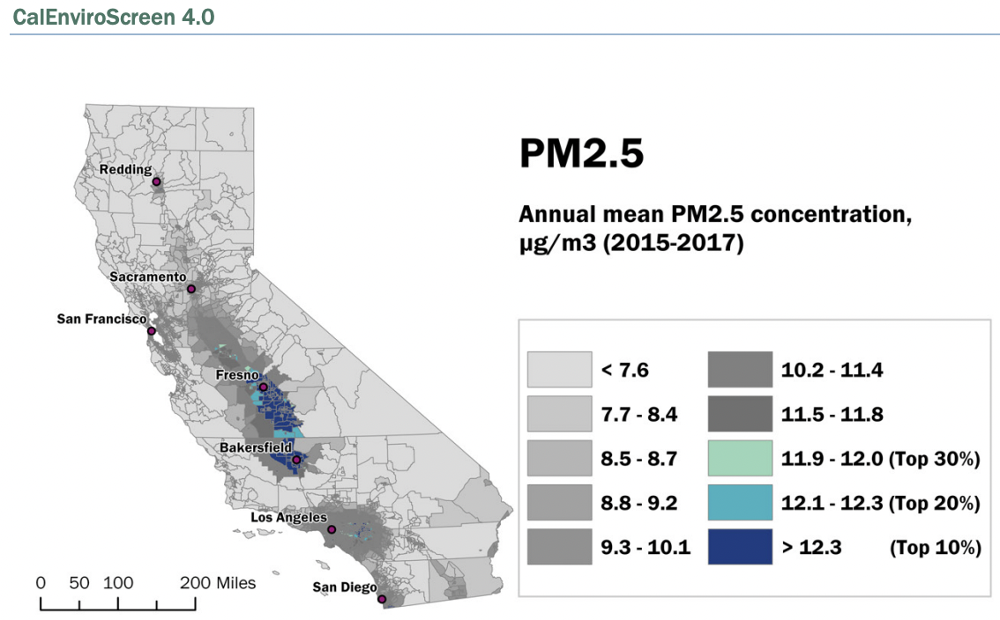

```{r setup, include=FALSE}
knitr::opts_chunk$set(echo = FALSE,
                      message = FALSE, 
                      warning = FALSE, 
                      include = TRUE)
library(tidyverse)
library(here)
library(gt)
library(xtable)
library(kableExtra)
```

# Research Question

In California from 2013 - 2021, does air quality (as measured by annual mean PM2.5 concentrations per census tract) vary with poverty rates (as measured by the percent of the population living below two times the federal poverty level per census tract)?

# Background

In California, events like wildfires can significantly decrease air quality by releasing fine particles such as particulate matter, or PM2.5 [@shi2019]. PM2.5 refers to particles with diameters ≤ 2.5 µm, which are known to be hazardous for human health. They are especially detrimental for our respiratory and cardiovascular health [@cleland2021]. As California's wildfires continue to worsen over time, it is becoming increasingly important to monitor air quality, PM2.5 concentrations, and their impacts on populations [@gupta2018].

The environmental burden of poor air quality is not shared equally across the state. For example, the San Joaquin Valley's economically disadvantaged and ethnically diverse communities breathe some of the most polluted air in the nation [@cisneros2017]. As a result, vulnerable communities such as Mexican American immigrant farm workers and their families experience disproportionately high rates of asthma attacks, hospital admissions, and other medical issues [@schwartz2009]. This inequitable pattern is well recognized in other states [@qian2019], the United States overall [@tessum2021], and even other countries [@li2018].

While there are many possible ways to explore the inequity of air pollution in California, I specifically use annual mean PM2.5 to measure of air quality and poverty rate to quantify socioeconomic disparities.

## Hypotheses

My null hypothesis (H~0~) is that, in California, there is no relationship between annual mean PM2.5 concentrations per census tract and percent of the population living below twice the federal poverty line per census tract.

My alternative hypothesis (H~A~) is that, in California, there is a relationship between annual mean PM2.5 concentrations per census tract and percent of the population living below twice the federal poverty line per census tract

# Data Description and Collection

```{r}
#read in data
c1 <- read_csv(file = here("_posts", 
                           "2021-11-18-calenviroscreen", 
                           "CES", 
                           "CES_data", 
                           "ces1_2013.csv"))
c2 <- read_csv(file = here("_posts", 
                           "2021-11-18-calenviroscreen", 
                           "CES", 
                           "CES_data", 
                           "ces2_2014.csv"))
c3 <- read_csv(file = here("_posts", 
                           "2021-11-18-calenviroscreen", 
                           "CES", 
                           "CES_data", 
                           "ces3_2018.csv"))
c4 <- read_csv(file = here("_posts", 
                           "2021-11-18-calenviroscreen", 
                           "CES", 
                           "CES_data", 
                           "ces4_2021.csv"))
#clean data 
c1_clean <- c1 %>% 
  select(c("ZIP Code","Poverty", "PM2.5")) %>% 
  mutate(Year = "2013") %>% 
  dplyr::rename(ZIP = "ZIP Code") %>% 
  mutate(ZIP = as.numeric(ZIP))
c2_clean <- c2 %>% 
  select(c("Census Tract", "California County", "ZIP", "Longitude", "Latitude", "Poverty", "PM2.5")) %>% 
  mutate(Year = "2014",
         ZIP = as.numeric(ZIP))
c3_clean <- c3 %>% 
  select(c("Census Tract", "California County", "ZIP", "Longitude", "Latitude", "Poverty", "PM2.5")) %>% 
  mutate(Year = "2018",
         ZIP = as.numeric(ZIP))
c4_clean <- c4 %>% 
  select(c("Census Tract", "California County", "ZIP", "Longitude", "Latitude", "Poverty", "PM2.5")) %>% 
  mutate(Year = "2021",
         ZIP = as.numeric(ZIP))
```

```{r}
#fill in missing column data for c1 dataset so all datasets match 
c1_fill <- full_join(x = c2_clean, y = c1_clean, 
                     by = "ZIP", 
                     suffix = c(".c2", ".c1")) %>%
  select(c("Census Tract", 
           "California County", 
           "ZIP", 
           "Longitude", 
           "Latitude", 
           "Poverty.c1", 
           "PM2.5.c1", 
           "Year.c1")) %>%
  dplyr::rename(Poverty = "Poverty.c1",
                PM2.5 = "PM2.5.c1",
                Year = "Year.c1")
```

```{r}
#rbind datasets (which need to have the same columns)
joined <- rbind(c4_clean, c3_clean, c2_clean, c1_fill) %>% 
  mutate(Year = as.factor(Year),
         Year = factor(x = Year, levels = c("2013", "2014", "2018", "2021"))) %>% 
  drop_na(Year) 
#we end up with 32,554 rows of data 
```

I downloaded 2013 - 2021 CalEnviroScreen (CES) data from the [California Office of Environmental Health Hazard Assessment (OEHHA)](https://oehha.ca.gov/) and the [California Open Data Portal](https://data.ca.gov/):

-   [Versions 1.1 (Sept 2013)](https://oehha.ca.gov/calenviroscreen/report-general-info/calenviroscreen-11)
-   [Versions 2.0 (Oct 2014)](https://oehha.ca.gov/calenviroscreen/report/calenviroscreen-version-20)
-   [Versions 3.0 (June 2018)](https://data.ca.gov/dataset/calenviroscreen-3-0-results)
-   [Versions 4.0 (Oct 2021)](https://oehha.ca.gov/calenviroscreen/report/calenviroscreen-40)

Each CES data set contains columns of environmental pollution burden indicators, inclding exposure indicators such as PM2.5, and population characteristics, including socioeconomic factor indicators such as rates of poverty. Each data set contains one row per census tract, meaning each census tract in California is assigned a value per environmental indicator or population characteristic.

{width="50%"}

Out of all these components, I am interested in:

### 1. **PM2.5**

The annual mean concentration of PM2.5, which CES calculates based on a weighted average of measured monitor concentrations and satellite observations (ug/m^3^) over 3 years. For example, the CES 1.1. report used data from 2007 - 2009 while the CES 4.0 report used 2015 - 2017. All reports used data from the [[California Air Resources Board's]{.ul}](https://ww2.arb.ca.gov/homepage) Air Monitoring Network. In addition to the Air Monitoring Network, CES 3.0 and CES 4.0 incorporated [[Satellite Remote Sensing Data]{.ul}](https://ww2.arb.ca.gov/resources/documents/air-quality-research-using-satellite-remote-sensing).

```{r, fig.cap = '2013 - 2021 mean PM2.5 in California was not normally distributed. In 2013, 2014, 2018, and 2021, the annual mean concentrations of PM2.5 (µg/m3) per census tract were 11.52, 10.01, 10.38, and 10.15 respectively. Data was sourced from CalEnviroScreen 1.1 - 4.0 (https://oehha.ca.gov/).'}

ggplot(data = joined, aes(x = PM2.5)) + 
  geom_histogram(aes(fill = Year), binwidth = 1) + 
  theme_classic() + 
  facet_wrap(~Year, ncol = 2) + 
  labs(x = expression(paste("Mean PM2.5 per census tract (µg/m"^3~")")),
       y = "Frequency")
```

Data were more likely to be high resolution around certain cities or localized areas, but not all cities have air monitoring stations. Locales with little to no data were either omitted or estimated using nearby locations' data. For example, in CES 1.1, census tracts with centers \> 50km away from the nearest air monitor were omitted from the analysis. In CES 4.0, missing data was estimated using regression relationships with nearby sites.

PM2.5 annual mean monitoring data were extracted from all monitoring sites where possible. For CES 4.0, PM2.5 annual mean concentrations were also calculated using Aerosol Optical Depth measurements in addition to land use and meteorology data via regression on ground monitor data.

For CES 1.1 - 3.0, the geographic center of each census tract, quarterly mean PM2.5 concentrations were estimated using ordinary kriging. For CES 4.0, overall PM2.5 annual mean concentrations were estimated for each 1km x 1km grid cell using both the monitoring and satellite data in a weighted average. An inverse-distance weighting method was used, so grid cells close to monitors relied more heavily on monitor estimates while grid cells further from monitors relied more heavily on satellite data. Grid cells with monitors \> 50km away relied solely on satellite data. Concentrations were estimated at the center of each 1km x 1km grid cell.

The quarterly estimates were then averaged to calculate annual means. The annual means were estimated over 3 years to avoid account for uneven sampling frequency.

{width="70%"}

### 2. **Poverty**

The percent of the population living below two times the federal poverty level, which CES calculates using a 5-year estimate. For example, the CES 1.1 report used a 5-year estimate from 2007 - 2011 data while the CES 4.0 report used a 5-year estimate from 2015 - 2019 data. Poverty data came from the [[American Community Survey]{.ul}](https://www.census.gov/programs-surveys/acs). Multiple years of data are used to calculate more reliable results for geographic areas with small populations.

```{r, fig.cap = '2013 - 2021 poverty rates in California were not normally distributed. In 2013, 2014, 2018, and 2021, the mean percentages of the population per census tract living below two times the federal poverty level were 34.24%, 35.28%, 36.39%, and 31.34% respectively. Data was sourced from CalEnviroScreen 1.1 - 4.0 (https://oehha.ca.gov/).'}

ggplot(data = joined, aes(x = Poverty)) + 
  geom_histogram(aes(fill = Year), binwidth = 5) + 
  theme_classic() + 
  facet_wrap(~Year, ncol = 2) + 
  labs(x = "Poverty rate per census tract (%)", 
       y = "Frequency")
```

CES defined poverty as twice below the federal poverty line to account for California's high cost of living relative to other states and because the federal poverty threshold has not changed since the 1980s despite the cost of living increasing over time. The percent per census tract was calculated by individuals living below 200% the poverty level per census tract / total individuals living below 200% of the poverty level. Standard error and relative standard error were calculated to determine the reliability of the calculated poverty rate. Census tracts with unreliable estimates were assigned no value for poverty rate (NULL).

{width="50%"}

# Methods - Statistical Analysis Plan

To assess if, in California from 2013 - 2021, air quality varies with poverty rates, I plan to run linear regressions of `PM2.5 ~ Poverty` for each year (e.g., 2013, 2014, 2018, 2021). This analysis is appropriate to describe how air quality might be changing with respect to poverty rates. Running multiple regressions over the different years can help us understand how this relationship might be changing over time.

This method is limited by the fact that I am only including one independent variable (`Poverty`) in the model. It is likely that there are many different factors in addition to poverty influencing air quality, but this analysis is a strong starting point for unraveling those complex relationships.

# Results

```{r}
mod1 <- lm(PM2.5 ~ Poverty, data = c1)
sum1 <- summary(mod1)

mod2 <- lm(PM2.5 ~ Poverty, data = c2)
sum2 <- summary(mod2)

mod3 <- lm(PM2.5 ~ Poverty, data = c3)
sum3 <- summary(mod3)

mod4 <- lm(PM2.5 ~ Poverty, data = c4)
sum4 <- summary(mod4)
```

For all time periods, annual mean PM2.5 concentrations were significantly influenced by the percent of people living below twice the federal poverty level. In 2013, PM2.5 increased by 0.035 µg/m3 as the poverty rate increased by 1% (p-value = `r sum1$coefficients[8]`, sd = `r sum1$coefficients[4]`, slope = `r sum1$coefficients[2]`). In 2014, PM2.5 increased by 0.028 µg/m3 as the poverty rate increased by 1% (p-value = `r sum2$coefficients[8]`, sd = `r sum2$coefficients[4]`, slope = `r sum2$coefficients[2]`). In 2018, PM2.5 increased by 0.030 µg/m3 as the poverty rate increased by 1% (p-value = `r sum3$coefficients[8]`, sd = `r sum3$coefficients[4]`, slope = `r sum3$coefficients[2]`). In 2021, PM2.5 increased by 0.029 µg/m3 as the poverty rate increased by 1% (p-value = `r sum4$coefficients[8]`, sd = `r sum4$coefficients[4]`, slope = `r sum4$coefficients[2]`).

These results support my hypothesis that mean PM2.5 and poverty in California are significantly related (Figure \@ref(fig:final)).

```{r final, fig.cap = 'Air quality significantly associates poverty in California. For each sampled time period, as poverty rates increase in California, mean PM2.5 increases and air quality deteriorates (p-value <<< 0.05).'}
joined <- joined %>% 
  drop_na(Poverty, PM2.5)

ggplot(data = joined, aes(x = Poverty, y = PM2.5)) +
  geom_point(aes(color = Year), alpha = 0.05) + 
  geom_smooth(method='lm', 
              formula= y~x,
              size=1, 
              color = "black") + 
  theme_classic()+ 
  labs(x = "Poverty rate (%)",
       y = expression(paste
                       ("Mean PM2.5 (µg/m"^3~")")),
       caption = "Caption") +
  facet_wrap(.~Year, ncol = 2) + 
  theme(legend.position = "none")
```

# Conclusions

As expected, I found---in California during 2013, 2014, 2018, and 2021---a statistically significant relationship between air quality and poverty rates. For all four years, annual mean concentrations of PM2.5 (µg/m^3^) increased as the percent of people living below twice the federal poverty level increased (Figure \@ref(fig:final)). In other words, air quality was lower in census tracts with higher poverty rates. These findings supported my hypothesis and corroborated prior research that has identified PM2.5 disparities based on socioeconomic factors in California (Mousavi et al. 2021). This further emphasizes the importance of an environmental justice lens when investigating issues such as air quality.

# Future Directions

While my analysis focused on four specific years of comprehensive data based on years that the CalEnviroScreen was carried out, it could be interesting to expand that time frame to before 2013. Exploring air quality and poverty before and after 2013 is especially interesting because 2013 was the year that California's cap-and-trade program was initiated. During this time, there is evidence that while greenhouse gases were overall reduced in California, socioeconomically disadvantaged communities actually experienced emission increases [@cushing2018].

# GitHub

The full code can be accessed [here](https://github.com/miaforsline/miaforsline.github.io/tree/main/_posts/2021-11-18-calenviroscreen).
