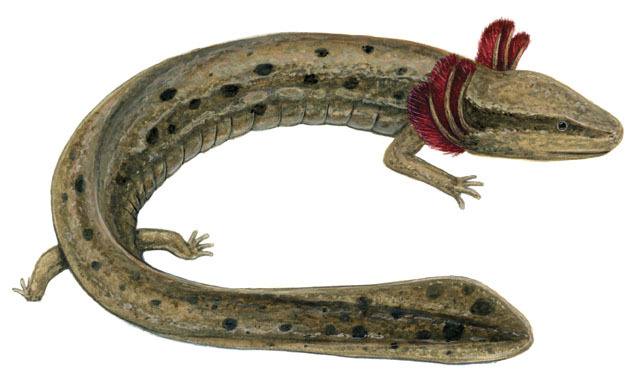
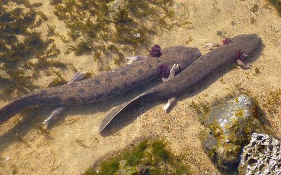
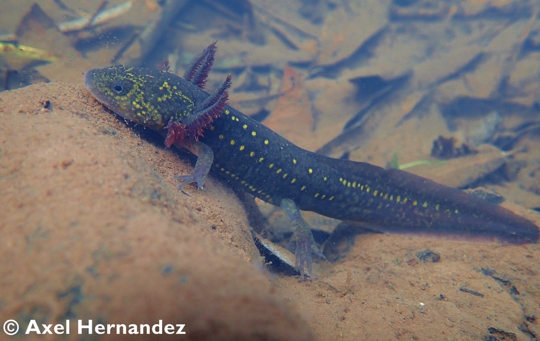

# Learning Objectives:

**Lab 1a - Explore**

-   Fetch species observations from the Global Biodiversity Information Facility (GBIF.org) using an R package that wraps a function around their API.
-   Fetch environmental data for defining environmental relationship in the species distribution model (SDM).
-   Generate pseudo-absences, or background, points with which to differentiate from the species presence points in the SDM.
-   Extract underlying environmental data from points.
-   Plot term plots of each environmental predictor with the species response.

**Lab 1b - Logistic Regression**

-   Pairs plot to show correlation between variables and avoid multicollinearity (see 8.2 Many predictors in a model) Logistic Regression seen as an evolution of techniques
-   Linear Model to show simplest multivariate regression, but predictions can be outside the binary values.
-   Generalized Linear Model uses a logit transformation to constrain the outputs to being within two values.
-   Generalized Additive Model allows for "wiggle" in predictor terms.
-   Maxent (Maximum Entropy) is a presence-only modeling technique that allows for a more complex set of shapes between predictor and response.

**Lab 1c - Decision Trees**

-   explore Supervised Classification for categorical values

    -   this is considered a Classification, while Supervised Classification for continuous values is called a Regression

-   use Decision Trees as a Classification technique to classify categorical species presence and absence data

    -   specifically, use Recursive Partitioning and Random Forest techniques

**Lab 1d - Evaluate the model**

-   Evaluate model performance
-   Calibrate model parameters

```{r setup, include=FALSE}
knitr::opts_chunk$set(echo = TRUE,
                      message = FALSE, 
                      warning = FALSE, 
                      include = TRUE)
```

# Set up

```{r}
# load packages, installing if missing
if (!require(librarian)){
  install.packages("librarian")
  library(librarian)
}

librarian::shelf(
  caret, # m: modeling framework
  dismo, # species distribution modeling: maxent(), predict(), evaluate(),
  dplyr,
  DT,
  GGally,
  ggplot2,
  here,
  htmltools,
  leaflet,
  maptools,
  mapview,
  mgcv,
  pdp,         # X: partial dependence plots
  purrr,
  ranger,
  raster,
  readr,
  rgbif,
  rgdal,
  rJava,
  rpart,       # m: recursive partition modeling
  rpart.plot,  # m: recursive partition plotting
  rsample,     # d: split train/test data
  sdmpredictors,
  sf,
  skimr,       # d: skim summarize data table
  spocc,
  tidyr,
  usdm,  # uncertainty analysis for species distribution models: vifcor()
  vip)         # X: variable importance

select = dplyr::select

select <- dplyr::select # overwrite raster::select

options(
  scipen = 999,
  readr.show_col_types = F)

# set random seed for reproducibility
set.seed(42)

#set ggplot theme
ggplot2::theme_set(ggplot2::theme_light())
```

# Lab 1 - Explore 

## 1. Get species observation data for *Necturus maculosus*, the common mudpuppy salamander from GBIF

## 2. Image of *N. maculosus* 





## Retrieve species occurrence data from GBIF

-   retrieve only observations with latitude and longitude coordinates

-   there are 1,205 *N. maculosus* observations in total

-   Extract and clean data from the GBIF retrieval results

    -   keep only *N. maculosus* observation points
    -   keep only relevant column information
    -   remove duplicate observations
    -   after cleaning, there are 776 *N. maculosus* observation points

-   Use longitude and latitude to create points of observation and put them in a data frame

    -   add CRS 4326

```{r}
# directory to store data
dir_data <- here("data/sdm")
dir.create(dir_data, showWarnings = F, recursive = T)

obs_csv <- file.path(dir_data, "obs.csv")
obs_geo <- file.path(dir_data, "obs.geojson")
redo    <- FALSE 

    if (!file.exists(obs_geo) | redo){
      (res <- spocc::occ(
        query = 'Necturus maculosus',
        from = 'gbif',
        limit = 10000,
        has_coords = T))

      # extract data frame from result
      df <- res$gbif$data[[1]]
      
      #clean the data 
      df_clean <- df %>% 
      filter(name %in% c("Necturus maculosus (Rafinesque, 1818)", "Necturus maculosus maculosus")) %>% #remove weirdly named points
      filter(longitude < 0) %>% #remove one observation in Europe 
      select(c("name", "longitude", "latitude", "key", "lifeStage", "stateProvince", "year"))
      
      #remove duplicates 
      dups2 <- duplicated(df_clean[, c('longitude', 'latitude')])
      sum(dups2)
      df_clean <- df_clean[!dups2, ]
      
      readr::write_csv(df_clean, obs_csv)

      # convert to points of observation from lon/lat columns in data frame
      obs <- df_clean %>%
        sf::st_as_sf(
          coords = c("longitude", "latitude"),
          crs = st_crs(4326))
      
      sf::write_sf(obs, obs_geo, delete_dsn=T)
    }

obs <- sf::read_sf(obs_geo)
nrow(obs) # number of rows
```

## 3. Map the distribution of points

```{r}
#mapview::mapview(obs, map.types = "Stamen.Watercolor")
```

## 4. **Question 1.** How many observations total are in GBIF for your species?

In total, GBIF contains 1,205 observations of *N. maculosus*.

## 5. **Question 2.** Do you see any odd observations, like marine species on land or vice versa? If so, please see the Data Cleaning and explain what you did to fix or remove these points.

Yes, I removed observations with the incorrect species name as well as one outlier observation point located in Europe. I also removed 421 duplicate observations.

## Get Environment Data using `sdmpredictors`

### Presence

-   retrieve terrestrial environmental data for predicting the niche of the *N. maculosus* observations

```{r}
dir_env <- file.path(dir_data, "env")

# set a default data directory
options(sdmpredictors_datadir = dir_env)

# choosing terrestrial data only 
env_datasets <- sdmpredictors::list_datasets(terrestrial = TRUE, marine = FALSE)
```

### View layers from the WorldClim and ENVIREM datasets

```{r}
# choose datasets for a vector
env_datasets_vec <- c("WorldClim", "ENVIREM")

# get layers
env_layers <- sdmpredictors::list_layers(env_datasets_vec)
```

## 6. Select appropriate layers

Prior work suggests that *N. maculosus* species distribution is most influenced by environmental variables not related to climate such as urban development, agriculture, tree canopy cover, and road density ([Fischer 2020](https://scholarworks.iupui.edu/handle/1805/22884)). However, other aquatic salamander species such as *Ambystoma ordinarium*, a mole salamander from Mexico, have been shown to be best predicted by WorldClim variables ([Escalera-Vásquez et al. 2018](https://doi.org/10.1655/Herpetologica-D-16-00078.1)). Furthermore, as ectotherms, salamanders are known to be sensitive to both temperature and moisture shifts ([McEntire and Maerz 2019](https://www.frontiersin.org/articles/10.3389/fevo.2019.00022/full)).



-   WorldClim:

    -   altitude
    -   annual mean temperature
    -   mean diurnal temperature range
    -   temperature seasonality
    -   minimum temperature of the coldest month
    -   annual precipitation
    -   precipitation of the driest month

-   ENVIREM

    -   climatic moisture index
    -   terrain roughness index
    -   topographic wetness

-   map the environmental layers on a global scale

```{r}
# choose layers after some inspection and perhaps consulting literature
env_layers_vec <- c("WC_alt", #altitude 
                    "WC_bio1", #annual mean temp 
                    "WC_bio2", #mean diurnal temp range 
                    "WC_bio4", #temperature seasonality 
                    "WC_bio6", #minimum temperature of the coldest month 
                    "WC_bio12", #annual precipitation 
                    "WC_bio14", #precipitation of the driest month 
                    "ER_climaticMoistureIndex", #climatic moisture index 
                    "ER_tri", #terrain roughness index 
                    "ER_topoWet") #topographic wetness

# get layers
env_stack <- load_layers(env_layers_vec)

# interactive plot layers, hiding all but first (select others)
#mapview(env_stack, hide = T)
```

## Create a convex hull to crop the environmental layers to the area of interest

-   map the convex hull

```{r}
obs_hull_geo  <- file.path(dir_data, "obs_hull.geojson")
env_stack_grd <- file.path(dir_data, "env_stack.grd")

if (!file.exists(obs_hull_geo) | redo){
  # make convex hull around points of observation
  obs_hull <- sf::st_convex_hull(st_union(obs))
  
  # save obs hull
  write_sf(obs_hull, obs_hull_geo)
}
obs_hull <- read_sf(obs_hull_geo)

#mapview(list(obs, obs_hull))
```

## 7. Map the environmental raster clipped to the species range 

```{r}
if (!file.exists(env_stack_grd) | redo){
  obs_hull_sp <- sf::as_Spatial(obs_hull)
  env_stack <- raster::mask(env_stack, obs_hull_sp) %>% 
    raster::crop(extent(obs_hull_sp))
  writeRaster(env_stack, env_stack_grd, overwrite=T)  
}
env_stack <- stack(env_stack_grd)
plot(env_stack, nc=2)

# show map
# mapview(obs) + 
#   mapview(env_stack, hide = T) # makes html too big for Github
```

## 8. Map pseudo-absence points 

-   count observations in the raster
-   create a mask
-   generate random pseudo-absence points inside the mask
-   map the presence and pseudo-absence points

```{r}
absence_geo <- file.path(dir_data, "absence.geojson")
pts_geo     <- file.path(dir_data, "pts.geojson")
pts_env_csv <- file.path(dir_data, "pts_env.csv")

if (!file.exists(absence_geo) | redo){
  # get raster count of observations
  r_obs <- rasterize(
    sf::as_Spatial(obs), env_stack[[1]], field=1, fun='count')
  
  # show map
  # mapview(obs) + 
  #   mapview(r_obs)
  
  # create mask for 
  r_mask <- mask(env_stack[[1]] > -Inf, r_obs, inverse=T)
  
  # generate random points inside mask
  absence <- dismo::randomPoints(r_mask, nrow(obs)) %>% 
    as_tibble() %>% 
    st_as_sf(coords = c("x", "y"), crs = 4326)
  
  write_sf(absence, absence_geo, delete_dsn=T)
}
absence <- read_sf(absence_geo)

# show map of presence, ie obs, and absence
# mapview(obs, col.regions = "green") + 
#   mapview(absence, col.regions = "gray")
```

## Combine presence and absence into single set of labeled points

-   display a table of all labeled data points that will feed into the species distribution model

    -   Y is the present column where 1 = present and 0 = absent
    -   X is all other columns (the environmental layers)

```{r}
    if (!file.exists(pts_env_csv) | redo){

      # combine presence and absence into single set of labeled points 
      pts <- rbind(
        obs %>% 
          mutate(
            present = 1) %>% 
          select(present, key),
        absence %>% 
          mutate(
            present = 0,
            key     = NA)) %>% 
        mutate(
          ID = 1:n()) %>% 
        relocate(ID)
      write_sf(pts, pts_geo, delete_dsn=T)

      # extract raster values for points
      pts_env <- raster::extract(env_stack, as_Spatial(pts), df=TRUE) %>% 
        tibble() %>% 
        # join present and geometry columns to raster value results for points
        left_join(
          pts %>% 
            select(ID, present),
          by = "ID") %>% 
        relocate(present, .after = ID) %>% 
        # extract lon, lat as single columns
        mutate(
          #present = factor(present),
          lon = st_coordinates(geometry)[,1],
          lat = st_coordinates(geometry)[,2]) %>% 
        select(-geometry)
      write_csv(pts_env, pts_env_csv)
    }
    pts_env <- read_csv(pts_env_csv)

    pts_env %>% 
      # show first 10 presence, last 10 absence
      slice(c(1:10, (nrow(pts_env)-9):nrow(pts_env))) %>% 
      DT::datatable(
        rownames = F,
        options = list(
          dom = "t",
          pageLength = 20))
```

## 9. Environmental variable term plots

-   density histogram where density is on the y axis

```{r}
pts_env %>% 
  select(-ID) %>% 
  mutate(
    present = factor(present)) %>% 
  pivot_longer(-present) %>% 
  ggplot() +
  geom_density(aes(x = value, fill = present)) + 
  scale_fill_manual(values = alpha(c("gray", "green"), 0.5)) +
  scale_x_continuous(expand=c(0,0)) +
  scale_y_continuous(expand=c(0,0)) +
  theme_bw() + 
  facet_wrap(~name, scales = "free") +
  theme(
    legend.position = c(1, 0),
    legend.justification = c(1, 0))
```

# Lab 2 - Logistic Regression 

## 10. Use `GGally` to look at pair plots and examine correlations between environmental variables 
```{r}
dir_data    <- here("data/sdm")
pts_env_csv <- file.path(dir_data, "pts_env.csv")

pts_env <- read_csv(pts_env_csv)
#nrow(pts_env)

# GGally::ggpairs(
#   select(pts_env, -ID),
#   aes(color = factor(present)))
```

## Logistic Regression 

### Setup Data 
- drop rows of data with any NA values (later, we'll learn how to impute values)
- remove terms we don't want to model 
```{r}
d <- pts_env %>% 
  select(-ID) %>%  # remove terms we don't want to model
  tidyr::drop_na() # drop the rows with NA values
```


## 11. Linear Model 
- dependent variable Y: presence/absence, aka 1/0
- independent variables X: everything else in the dataframe, aka the environmental layers 
```{r}
mod <- lm(present ~ ., data = d)
```


Note: a linear model is ineffective because it predicts values outside the 0 - 1 range
```{r}
y_predict <- predict(mod, d, type="response")
y_true    <- d$present

range(y_predict)
range(y_true)
```

## 12. Generalized Linear Model

To solve this problem, we will apply a Logit Transformation 
```{r}
# fit a generalized linear model with a binomial logit link function
mod <- glm(present ~ ., family = binomial(link="logit"), data = d)
```

Note: we are not within the 0 - 1 range we want to be in
```{r}
y_predict <- predict(mod, d, type="response")
range(y_predict)
```

### 13. GLM Term Plots 
```{r}
termplot(mod, partial.resid = TRUE, se = TRUE, main = F)
```

## 14. Generalized Additive Model (GAM)
We can further improve the GLM by adding "wiggle" to the relationship between the predictor and response variables 
```{r}
# fit a generalized additive model with smooth predictors
mod <- mgcv::gam(
  formula = present ~ s(WC_alt) + 
                      s(WC_bio1) + 
                      s(WC_bio2) +
                      s(WC_bio4) +
                      s(WC_bio6) + 
                      s(WC_bio12) +
                      s(WC_bio14) + 
                      s(ER_climaticMoistureIndex) + 
                      s(ER_tri) + 
                      s(ER_topoWet) + 
                      s(lon) + 
                      s(lat), 
  family = binomial, data = d)
#summary(mod)
```

### 15. GAM Term Plots 
```{r}
plot(mod, scale=0)
```

### 16. **Question:** Which GAM environmental variables, and even range of values, seem to contribute most towards presence (above 0 response) versus absence (below 0 response)?

Annual Precipitation (`WC_bio12`) and Longitude (`lon`) were the most statistically significant in the GAM model (p-value <<< 0). The Climatic Moisture Index (`ER_climaticMoistureIndex`),  Terrain Roughness Index (`ER_tri`), and latitude (`lat`) were the next most statistically significant variables in the GAM model (p-value < 0.001).

## 17. Maxent (Max Entropy)
This is the most commonly used species distribution model because it requires few input data points, all of which can be presence observation points, and is easy to use with a Java GUI. 
- plot environmental rasters 
```{r}
# show version of maxent
#maxent()

env_stack_grd <- file.path(dir_data, "env_stack.grd")
env_stack <- stack(env_stack_grd)
plot(env_stack, nc=2)
```
Get present-only observation points and fit maximum entropy model 
```{r}
obs_geo <- file.path(dir_data, "obs.geojson")
obs_sp <- read_sf(obs_geo) %>% 
  sf::as_Spatial() # maxent prefers sp::SpatialPoints over newer sf::sf class

#note: always breaks when you try to run it all at once. have to restart the R session, re-run the Set Up chunk, then this runs. 
mod <- maxent(env_stack, obs_sp)
```

### 18. Maxent variable contribution plot 
- plot variable contributions per predictor
```{r}
plot(mod)
```

### 19. Maxent Term Plots 
```{r}
response(mod)
```

### 20. **Question:** Which Maxent environmental variables, and even range of values, seem to contribute most towards presence (closer to 1 response) and how might this differ from the GAM results?

Annual precipitation (`WC_bio12`) < 600 and annual precipitation > 1100, Terrain Roughness Index (`ER_tri`) > 100, and minimum temperature (`WC_bio6`) < -35 and WC_bio6 > 5 all seem to demonstrate fairly high predicted values. This is fewer variables than the GAM model, but there is overlap with annual precipitation and the Terrain Roughness Index. However, minimum temperature was not suggested by the GAM model. 

### Predict 
```{r}
y_predict <- predict(env_stack, mod) #, ext=ext, progress='')

plot(y_predict, main='Maxent, raw prediction')
data(wrld_simpl, package="maptools")
plot(wrld_simpl, add=TRUE, border='dark grey')
```

# Lab 3 - Decision Trees 

## Decision Trees 
- set up file paths 
- read in *Necturus maculosus* data 
- clean the data
  - remove unnecessary columns 
  - change the presence/absence data to a factor 
  - drop rows with NA values 
- summarize the data using `skim()`

```{r}
dir_data    <- here("data/sdm")
pts_env_csv <- file.path(dir_data, "pts_env.csv")

pts_env <- read_csv(pts_env_csv)

d <- pts_env %>% 
  select(-ID) %>%                   # not used as a predictor x
  mutate(present = factor(present)) %>%  # categorical response
  na.omit()                         # drop rows with NA

skim(d)
```

## Split data into training and test data sets 
- use 80% of the data to create a training data set 
- use 20% of the data to create a testing data set 
- view how many presence and absence data points are in each set 
  - present: 1
  - absent: 0
```{r}
d_split  <- rsample::initial_split(d, prop = 0.8, strata = "present")
d_train  <- rsample::training(d_split)

table(d$present)
table(d_train$present)
```

## 22. Partition, depth = 1 
- run decision stump model with one split and two nodes 
- plot the decision tree 
```{r}
mod <- rpart(present ~ ., data = d_train, 
             control = list(cp = 0, minbucket = 5, maxdepth = 1))
mod

par(mar = c(1, 1, 1, 1))
rpart.plot(mod)
```

## 23. Partition, depth = default 
- run decision tree model with default settings
- plot the decision tree 
- plot the complexity parameter using `plotcp()`
- display the cross validation results 
```{r}
mod <- rpart(present ~ ., data = d_train)
mod

rpart.plot(mod)
```

## 24. `Rpart` complexity parameter  

```{r}
plotcp(mod)

mod$cptable
```

## 25. **Question:** Based on the complexity plot threshold, what size of tree is recommended?

Approximately 10 branches are recommended to decrease the relative error without making the model too complicated. 

## Feature interpretation 
- plot caret cross validation results
  - as model complexity increases, its accuracy decreases 
  - in other words, it's detrimental for a model to become too complicated
```{r}
mdl_caret <- train(
  present ~ .,
  data       = d_train,
  method     = "rpart",
  trControl  = trainControl(method = "cv", number = 10),
  tuneLength = 20)

ggplot(mdl_caret) + theme_classic()
```


## 28. Examine the importance of each predictor 
```{r}
vip(mdl_caret, num_features = 40, bar = FALSE)
```

## 27. **Question:** what are the top 3 most important variables of your model?
In my model, the top 3 most important variables are: 
- latitude
- longitude
- and annual mean temperatire (`WC_bio1`). 

## Partial dependence plots
- construct and display plots for the 3 most important predictors 
```{r}
p1 <- partial(mdl_caret, pred.var = "lat") %>% autoplot()
p2 <- partial(mdl_caret, pred.var = "lon") %>% autoplot()
p3 <- partial(mdl_caret, pred.var = c("lat", "lon")) %>% 
  plotPartial(levelplot = FALSE, zlab = "yhat", drape = TRUE, 
              colorkey = TRUE, screen = list(z = -20, x = -60))

gridExtra::grid.arrange(p1, p2, p3, ncol = 3)
```

## Random Forests 

```{r}
# number of features
n_features <- length(setdiff(names(d_train), "present"))

# fit a default random forest model
mdl_rf <- ranger(present ~ ., data = d_train)

# get out of the box RMSE
(default_rmse <- sqrt(mdl_rf$prediction.error))
```

## 28. Random Forest variable importance 
```{r}
# re-run model with impurity-based variable importance
mdl_impurity <- ranger(
  present ~ ., data = d_train,
  importance = "impurity")

# re-run model with permutation-based variable importance
mdl_permutation <- ranger(
  present ~ ., data = d_train,
  importance = "permutation")
p1 <- vip::vip(mdl_impurity, bar = FALSE)
p2 <- vip::vip(mdl_permutation, bar = FALSE)

gridExtra::grid.arrange(p1, p2, nrow = 1)
```

## 29. **Question:** How might variable importance differ between rpart and RandomForest in your model outputs?

In my `rpart()` model, latitude, longitude, and annual mean temperature (`WC_bio1`) were the top three most important variables. In my random forest model, longitude, annual precipitation (`WC_bio12`), and latitude are the top three most important variables. Thus, there is overlap between latitude and longitude, but the different models weighed the WorldClim variables differently. 

# Lab 1d: Model Evaluation 

## Split observation data into training and testing sets
- the training data set uses 80% of the data 
- the testing data set uses the remaining 20% of the data 
```{r}
pts_split  <- rsample::initial_split(
  pts, prop = 0.8, strata = "present")
pts_train  <- rsample::training(pts_split)
pts_test   <- rsample::testing(pts_split)

pts_train_p <- pts_train %>% 
  filter(present == 1) %>% 
  as_Spatial()
pts_train_a <- pts_train %>% 
  filter(present == 0) %>% 
  as_Spatial()
```

## 30. Calibrate: Model Selection 
- use a pairs plot to check correlation between environmental variables and assess multicollinearity issues 
```{r}
pairs(env_stack)
```

## 31. Calculate variance inflation factor per predictor, a metric of multicollinearity between variables
```{r}
vif(env_stack)
```

## 32. Stepwise reduce predictors, based on a max correlation of 0.7
- conduct a multicollinearity reduction using `vifcor()`
```{r}
v <- vifcor(env_stack, th=0.7) 
v
```

## 33. Reduce the environmental raster stack by excluding variables that were too correlated 
- visualize the remaining variables with another pairs plot 
```{r}
env_stack_v <- usdm::exclude(env_stack, v)

pairs(env_stack_v)
```
## 34. Fit a maximum entropy model using `maxent()`
- plot variable contributions per predictor
```{r}
pts_train_test <- pts_train %>% 
  select(present, geometry)

if (!file.exists(mdl_maxv_rds)){
  mdl_maxv <- maxent(env_stack_v, pts_train)
  readr::write_rds(mdl_maxv, mdl_maxv_rds)
}
mdl_maxv <- read_rds(mdl_maxv_rds)

plot(mdl_maxv)
```
## 35. **Question:** Which variables were removed due to multicollinearity and what is the rank of most to least important remaining variables in your model?

Altitude (`WC_alt`), annual mean temperature (`WC_bio1`), mean diurnal temperature range (`WC_bio2`), minimum temperature (`WC_bio6`), annual precipitation (`WC_bio12`), precipitation of the driest month (`WC_bio14`), and the Terrain Roughness Index (`ER_tri`) were all removed. 

From most to least important, the remaining variables are temperature seasonality (`WC_bio4`), the Climatic Moisture Index (`ER_climaticMoistureIndex`), altitude (`WC_alt`), and topographic wetness (`ER_topoWet`). 

## 36. Maxent term plots
```{r}
response(mdl_maxv)
```

## 37. Map of Maxent prediction  
```{r}
y_maxv <- predict(env_stack, mdl_maxv) #, ext=ext, progress='')

plot(y_maxv, main='Maxent, raw prediction')
data(wrld_simpl, package="maptools")
plot(wrld_simpl, add=TRUE, border='dark grey')
```

## Evaluate Model Performance 

## Area Under the Curve (AUC), Receiver Operator Characteristic (ROC) Curve, and Confusion Matrix 
- split the test data into presence and absence
- use `dismo()` to calculate the AUC and max TPR + TNR
```{r}
pts_test_p <- pts_test %>% 
  filter(present == 1) %>% 
  as_Spatial()
pts_test_a <- pts_test %>% 
  filter(present == 0) %>% 
  as_Spatial()

y_maxv <- predict(mdl_maxv, env_stack)
#plot(y_maxv)

e <- dismo::evaluate(
  p     = pts_test_p,
  a     = pts_test_a, 
  model = mdl_maxv,
  x     = env_stack)
e
```
## Plot the ROC Curve and the Area Under the Curve (AUC) 
```{r}
plot(e, 'ROC')

thr <- threshold(e)[['spec_sens']]
thr
```

## 39. Create the Confusion Matrix 
```{r}
p_true <- na.omit(raster::extract(y_maxv, pts_test_p) >= thr)
a_true <- na.omit(raster::extract(y_maxv, pts_test_a) < thr)

# (t)rue/(f)alse (p)ositive/(n)egative rates
tpr <- sum(p_true)/length(p_true)
fnr <- sum(!p_true)/length(p_true)
fpr <- sum(!a_true)/length(a_true)
tnr <- sum(a_true)/length(a_true)

matrix(
  c(tpr, fnr,
    fpr, tnr), 
  nrow=2, dimnames = list(
    c("present_obs", "absent_obs"),
    c("present_pred", "absent_pred")))
```

## 40. Plot the ROC Curve and the Area Under the Curve (AUC) 
- identify the threshold and mark it in blue on the plot 
```{r}
plot(e, 'ROC')

thr <- threshold(e)[['spec_sens']]
thr

points(fpr, tpr, pch=23, bg="blue")
```


## 41. Plot the areas where we predict *Necturus maculosus* presence 
```{r}
plot(y_maxv > thr)
```
