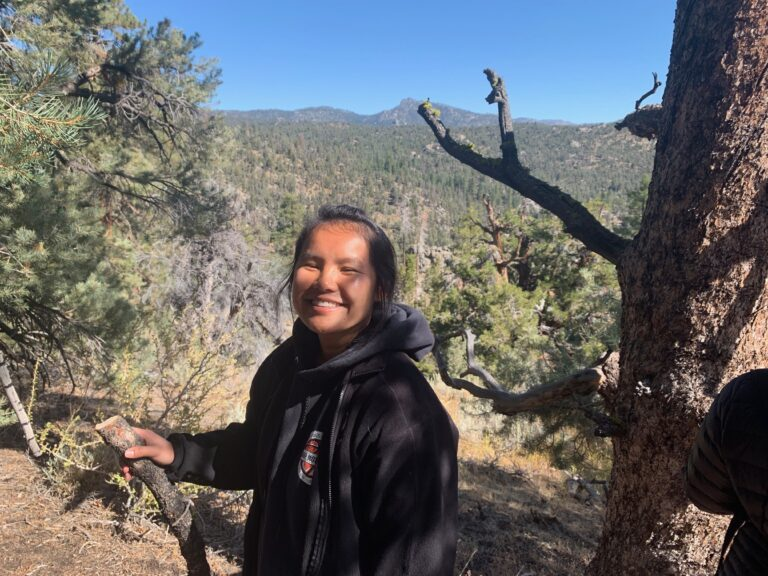
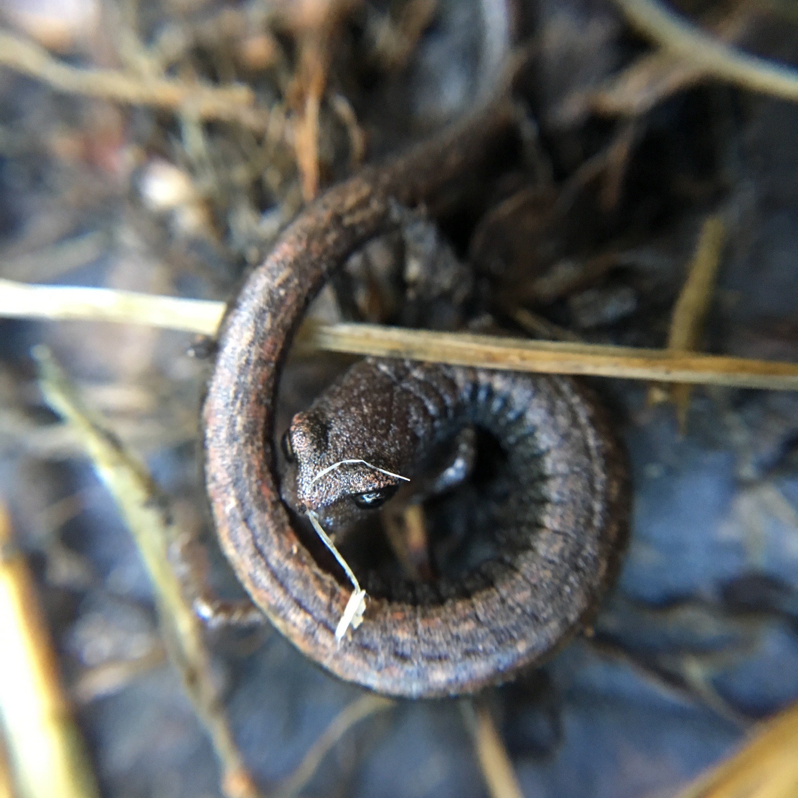
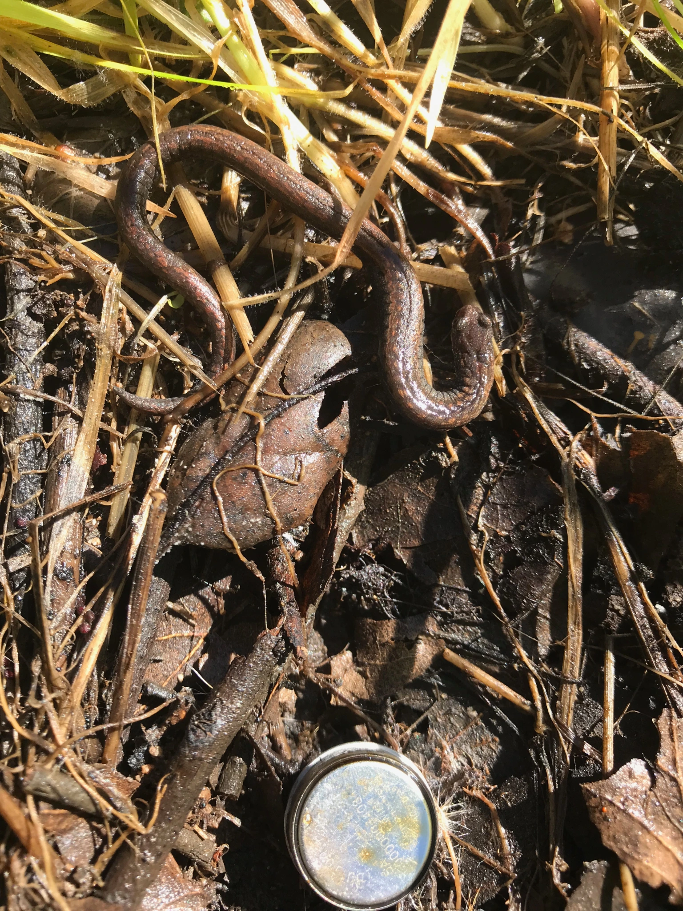
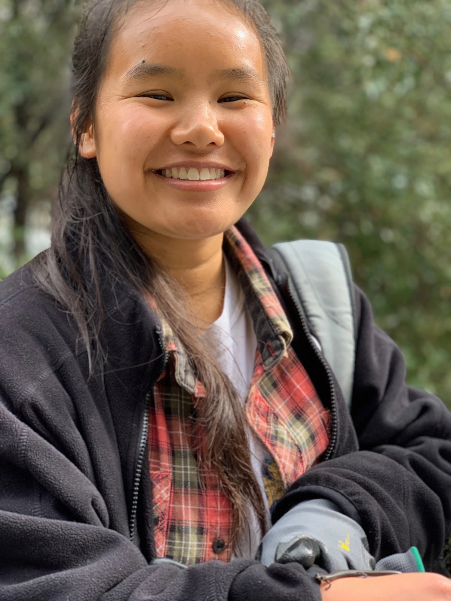

{width="50%"}

# Education

As a Jōdo Shinshū Buddhist, I was raised to respect and be curious about the natural world. My passion for the environment led me to earn a B.A. of Biology (with an Environmental Science emphasis) at Occidental College in Los Angeles, CA, where I graduated in 2021.

# Research

For three years at Occidental, I conducted [computational biology research](https://compbio.oxycreates.org/) to investigate how the urban heat island impacts local salamander populations. This research culminated in senior [Biology Honors Thesis](https://drive.google.com/file/d/1bvZ7s-Kp3Kz1PhLf399Tqh9A_eG1TvEj/view?usp=sharing), in which I explored how urbanization:

-   impacts temperatures in microhabitats of local salamanders ([*Batrachoseps nigriventris*](http://www.californiaherps.com/salamanders/pages/b.nigriventris.html), or the black-bellied slender salamander)
-   and influences connectivity of salamander (*B. nigriventris* and [*Batrachoseps major*](https://amphibiaweb.org/species/5340), the garden slender salamander) habitat patches.

{width="50%"} {width="50%"} {width="50%"}

I learned and executed computational methods in R and Julia such as: 

- downloading remotely sensed [National Land Cover Data](https://www.mrlc.gov/national-land-cover-database-nlcd-2016) from the [Multi-Resolution Land Characteristics Consortium](https://www.mrlc.gov/) to identify urban vs rural areas in Los Angeles County 
- building linear mixed-effects models using the `lme4` package
- utilizing AIC/AICc scores and AIC weights to identify the best model among multiple candidate models 
- building isolation-by-resistance models, based on [circuit theory](https://link.springer.com/content/pdf/10.1007%2Fs10980-017-0548-1.pdf), to calculate resistance distance and quantify landscape connectivity for wildlife mobility 

In this study, we utilized community science and landscape resistance modeling in order to study landscape connectivity for the two salamander species. Our results demonstrate the successful incorporation of community science observation data into the connectivity models, a valuable step forward in streamlining landscape connectivity research.

# Professional Experience

Furthermore, I was a Biostatistics Teaching Assistant and taught first-time users R and basic file management, both in-person and remotely. In addition to my computational biology experience, I worked in the Campus Dining department and promoted food sustainability on campus by leading a bi-annual budget analysis and supporting educational events for students interested in local food systems.

# Future

To continue to pursue my environmental and computational interests, I am currently a candidate for the Master of Environmental Data Science at the Bren School of Environmental Science and Management at UC Santa Barbara. I hope to continue working in urban environmental spaces and utilizing data analysis tools to address issues such as food sustainability.

```{r setup, include=FALSE}
knitr::opts_chunk$set(echo = FALSE)
```
